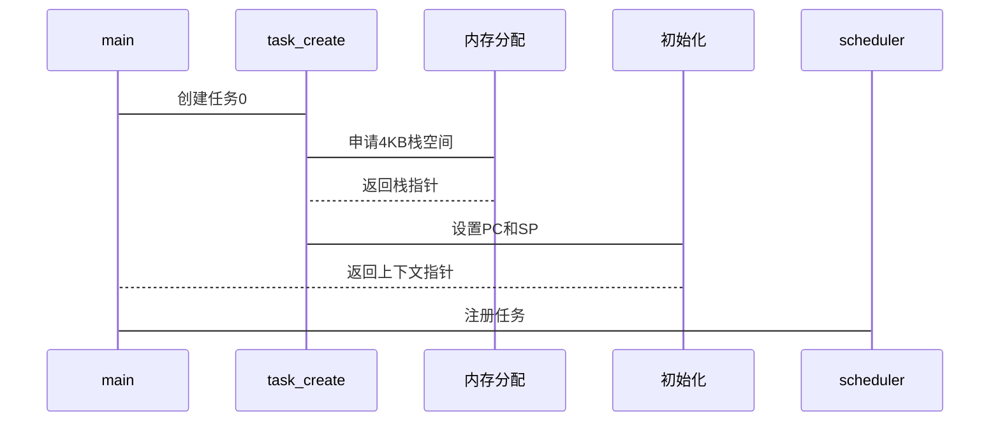

# RVOS - RISC-V 操作系统多任务模块

## 项目概述

本项目实现了 RISC-V 操作系统核心的**协作式多任务系统**，主要特性包括：

- 多任务创建与管理（支持动态任务数量）
- 循环调度算法实现
- 完整的上下文切换机制
- 内存空间隔离分配
- 调试信息输出支持

## 开发环境

### 硬件要求
- x86_64 主机（推荐 4 核 CPU + 8GB 内存）
- 磁盘空间：至少 2GB 可用空间

### 软件依赖
| 组件                    | 版本要求 | 安装方式                              |
| ----------------------- | -------- | ------------------------------------- |
| Ubuntu                  | ≥ 20.04  | [官网下载](https://ubuntu.com/)       |
| riscv64-unknown-elf-gcc | 10.2+    | `apt install gcc-riscv64-unknown-elf` |
| QEMU-system-riscv32     | ≥ 6.2    | `apt install qemu-system-misc`        |
| make                    | ≥ 4.2    | 系统自带                              |

## 快速开始

### 1. 获取源码
```bash
git clone https://github.com/your-repo/04-multitask.git
cd 04-multitask
```

### 2. 编译系统

```bash
make clean    # 清理构建产物
make all      # 生成 os.elf 可执行文件
```

### 3. 启动模拟器
```bash
make run      # 启动 QEMU 运行系统
```
退出方式：`Ctrl+A` → `X`

### 4. 观察输出
成功运行时将显示如下信息：
```text
Hello, RVOS!
HEAP_START = 0x8000487c(aligned to 0x80005000), HEAP_SIZE = 0x07ffb784,
num of reserved pages = 8, num of pages to be allocated for heap = 32755
...
Task 0: Created!
Task 1: Created!
[Switch] Task 0 → Task 1
[Context] SP=0x8000a000 PC=0x80002000
Task 1: Running...
```

## 系统架构

### 内存布局
| 段名称 | 起始地址   | 结束地址   | 大小  |
| ------ | ---------- | ---------- | ----- |
| TEXT   | 0x80000000 | 0x80002f70 | 12KB  |
| RODATA | 0x80002f70 | 0x8000316c | 500B  |
| HEAP   | 0x8000d000 | 0x88000000 | 128MB |

### 核心组件
```c
// 任务控制块
struct context {
    uint32_t regs[31];  // 通用寄存器
    uint32_t pc;        // 程序计数器
    uint8_t stack[4096];// 4KB 独立栈
};

// 调度器实现
void schedule() {
    _current = (_current + 1) % MAX_TASKS;
    struct context *next = &ctx_tasks[_current];
    switch_to(next);  // 汇编实现的上下文切换
}
```

##  关键机制

### 上下文切换流程
1. 保存当前寄存器到 `struct context`
2. 通过 `mscratch` CSR 交换上下文指针
3. 加载新任务的寄存器状态
4. 恢复 PC 执行新任务

### 任务创建时序


## 注意事项

1. **架构兼容性**
   - 必须使用 `-march=rv32g -mabi=ilp32` 编译参数
   - QEMU 启动参数需包含 `-machine virt -nographic`

2. **调试技巧**
   ```c
   // 在 uart.c 中添加调试输出
   void debug_switch(struct context *prev, struct context *next) {
       printf("[Switch] %p → %p\n", prev, next);
       printf("[SP] Prev=0x%x Next=0x%x\n", prev->regs[1], next->regs[1]);
   }
   ```

3. **常见问题**
   - 若出现 `libncurses` 错误：`ln -s /usr/lib/x86_64-linux-gnu/libncurses.so.6 /usr/lib/libncurses.so.5`
   - 栈溢出问题：检查任务函数中的局部变量大小
