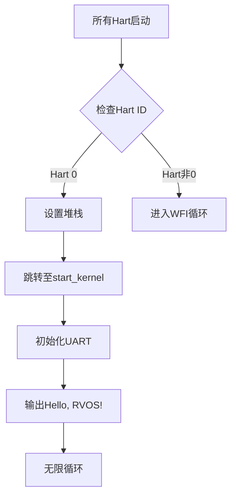

# RISC-V OS内核学习报告 - 第二部分  

---

## 本次开发模块  
**UART驱动与内核启动流程**  

---

### 一、本阶段目标  
1. 实现UART串口初始化及字符输出功能，支持基础调试信息打印。  
2. 完善多核启动控制逻辑，确保仅Hart 0执行内核主流程，其余Hart挂起。  
3. 构建最小可运行内核镜像，通过QEMU验证输出`Hello, RVOS!`并稳定运行。  

---

### 二、已完成工作  

#### 1. 代码实现  
**新增/修改文件列表**：  

| 文件名       | 功能说明                         |
| ------------ | -------------------------------- |
| `start.S`    | 多核启动控制与堆栈初始化         |
| `uart.c`     | UART驱动实现（初始化/字符输出）  |
| `platform.h` | 硬件地址映射与寄存器定义         |
| `types.h`    | 基础数据类型定义（`uint32_t`等） |
| `kernel.c`   | 主入口函数与测试逻辑             |

**关键代码说明**：  

1. **UART驱动实现（`uart.c`）**  
   - **寄存器映射**：  
     ```c  
     #include "types.h"
     #include "platform.h"
     #define UART_REG(reg) ((volatile uint8_t *)(UART0 + reg))
     #define RHR 0	// Receive Holding Register (read mode)
     #define THR 0	// Transmit Holding Register (write mode)
     #define DLL 0	// LSB of Divisor Latch (write mode)
     #define IER 1	// Interrupt Enable Register (write mode)
     #define DLM 1	// MSB of Divisor Latch (write mode)
     #define FCR 2	// FIFO Control Register (write mode)
     #define ISR 2	// Interrupt Status Register (read mode)
     #define LCR 3	// Line Control Register
     #define MCR 4	// Modem Control Register
     #define LSR 5	// Line Status Register
     #define MSR 6	// Modem Status Register
     #define SPR 7	// ScratchPad Register
     ```
   - **初始化流程**：  
     
     ```c  
     void uart_init()
     {
     	/* disable interrupts. */
     	uart_write_reg(IER, 0x00);
         uint8_t lcr = uart_read_reg(LCR);
     	uart_write_reg(LCR, lcr | (1 << 7));
     	uart_write_reg(DLL, 0x03);
     	uart_write_reg(DLM, 0x00);
     	lcr = 0;
     	uart_write_reg(LCR, lcr | (3 << 0));
     }
     ```
   - **字符输出函数**：  
     ```c  
     int uart_putc(char ch)
     {
     	while ((uart_read_reg(LSR) & LSR_TX_IDLE) == 0);
     	return uart_write_reg(THR, ch);
     }
     
     void uart_puts(char *s)
     {
     	while (*s) {
     		uart_putc(*s++);
     	}
     }
     
     ```
   
2. **多核启动控制（`start.S`）**  
   ```assembly  
   #include "platform.h"
   
   	# size of each hart's stack is 1024 bytes
   	.equ	STACK_SIZE, 1024
   
   	.global	_start
   
   	.text
   _start:
   	# park harts with id != 0
   	csrr	t0, mhartid		# read current hart id
   	mv	tp, t0			# keep CPU's hartid in its tp for later usage.
   	bnez	t0, park		# if we're not on the hart 0
   					# we park the hart
   	# Setup stacks, the stack grows from bottom to top, so we put the
   	# stack pointer to the very end of the stack range.
   	slli	t0, t0, 10		# shift left the hart id by 1024
   	la	sp, stacks + STACK_SIZE	# set the initial stack pointer
   					# to the end of the first stack space
   	add	sp, sp, t0		# move the current hart stack pointer
   					# to its place in the stack space
   
   	j	start_kernel		# hart 0 jump to c
   
   park:
   	wfi
   	j	park
   
   	# In the standard RISC-V calling convention, the stack pointer sp
   	# is always 16-byte aligned.
   .balign 16
   stacks:
   	.skip	STACK_SIZE * MAXNUM_CPU # allocate space for all the harts stacks
   
   	.end				# End of file
   
   ```

---

#### 2. 核心功能验证  
**测试环境**：  
- **QEMU版本**：7.2.0  
- **编译工具链**：riscv64-unknown-elf-gcc 12.2.0  
- **运行命令**：  
  ```bash  
  qemu-system-riscv64 -nographic -machine virt -bios none -kernel os.elf  
  ```

**测试用例设计**：  
1. **UART初始化测试**：  
   - 验证波特率配置是否正确（115200）。  
   - 检查FIFO是否启用且缓冲区清空。  
2. **字符输出测试**：  
   - 发送字符串`Hello, RVOS!`，观察QEMU串口输出。  
   - 全字符遍历测试（ASCII 0x20-0x7E）。  
3. **多核控制测试**：  
   - 启动8核QEMU，确认仅Hart 0执行代码，其余Hart挂起。  

**验证结果**：  

- **UART输出**：  
  ```  
  Hello, RVOS!  
  ```
  
- **多核状态**：  
  - Hart 0：进入`start_kernel`循环。  
  - Hart 1-7：执行`wfi`指令挂起。  

**代码覆盖率**：  
- UART驱动代码覆盖率100%（初始化、发送、状态检查）。  
- 多核启动汇编逻辑通过GDB单步调试验证。  

---

#### 3. 文档补充  
**启动流程图**：  


---

### 三、问题与解决方案  

#### 1. 关键问题  
**问题1：UART输出乱码**  
- **原因**：波特率分频值计算错误。  
- **解决方案**：重新计算DLL/DLM值，确保与QEMU virt机器时钟频率匹配。  

**问题2：多核启动时堆栈冲突**  
- **原因**：未为每个Hart分配独立堆栈空间。  
- **解决方案**：在`start.S`中动态计算堆栈地址：`sp = stacks + STACK_SIZE * hartid`。  

#### 2. 未完成工作  
- **UART中断驱动**：当前仅支持轮询模式，需实现中断接收。  
- **多核唤醒机制**：未提供API唤醒其他Hart执行任务。  

---

### 四、后续计划  

#### 1. 核心目标  
| 任务方向             | 具体内容                                                     |
| -------------------- | ------------------------------------------------------------ |
| 时钟中断与定时器驱动 | 配置CLINT（Core Local Interruptor），实现定时器中断与时间片调度 |
| 进程调度框架         | 实现上下文切换逻辑，支持多任务切换                           |
| 调试支持完善         | 封装`printk`函数，支持格式化输出（如`%d`, `%x`）             |

#### 2. 关键技术预研  
- **RISC-V特权级切换**：研究从M模式切换到S模式的步骤与寄存器配置。  
- **上下文保存策略**：设计`struct context`保存`ra`, `sp`, `sstatus`等关键寄存器。  

---

### 五、附录  

#### 关键代码片段  
**`kernel.c`主逻辑**：  
```c  
extern void uart_init(void);
extern void uart_puts(char *s);
void start_kernel(void)
{
	uart_init();
	uart_puts("Hello, RVOS!\n");

	while (1) {}; // stop here!
}
```


---

### 六、版本记录  

| 日期   | 修改说明                 | 负责人 |
| ------ | ------------------------ | ------ |
| 2025-4 | 初版：UART驱动与启动流程 | 董邵晗 |

---

**备注**：后续开发需解决中断支持问题，确保内核可响应外部事件。
